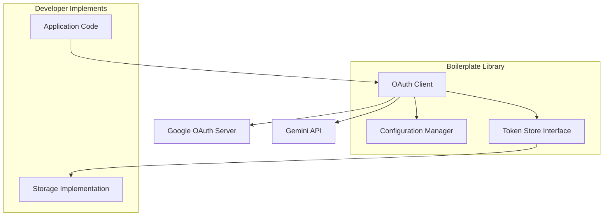
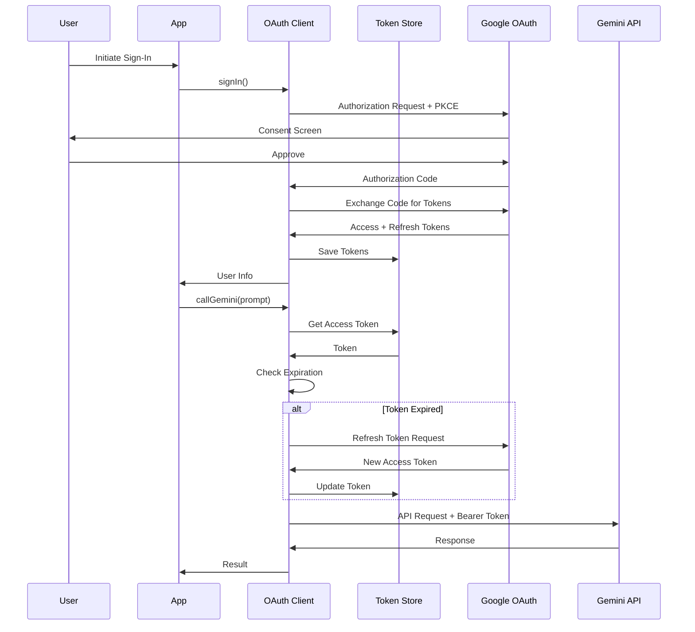

# Design Document

## Overview

This boilerplate provides a reusable TypeScript/JavaScript library for implementing Google OAuth 2.0 authentication with Gemini API access. The design emphasizes security, simplicity, and flexibility to support multiple application types (web, mobile, desktop) while handling the complete OAuth flow, token management, and authenticated API calls.

The architecture separates concerns into distinct modules: OAuth flow management, token storage, API client, and configuration. This separation allows developers to customize storage backends or extend functionality while maintaining a simple public API.

## Architecture

### High-Level Architecture



### Component Interaction Flow



## Components and Interfaces

### 1. OAuth Client

The main entry point for all OAuth operations. Manages the authorization flow, token lifecycle, and API calls.

```typescript
interface OAuthClientConfig {
  clientId: string;
  clientSecret?: string; // Optional for public clients
  redirectUri: string;
  scopes: string[];
  tokenStore: TokenStore;
  usePKCE?: boolean; // Default true for public clients
}

class GoogleOAuthClient {
  constructor(config: OAuthClientConfig);
  
  // Generate authorization URL for user to visit
  getAuthorizationUrl(state?: string): Promise<string>;
  
  // Exchange authorization code for tokens
  handleCallback(code: string, codeVerifier?: string): Promise<UserInfo>;
  
  // Sign out and revoke tokens
  signOut(userId: string): Promise<void>;
  
  // Make authenticated Gemini API call
  callGemini(userId: string, request: GeminiRequest): Promise<GeminiResponse>;
  
  // Get current user info from stored tokens
  getUserInfo(userId: string): Promise<UserInfo | null>;
}
```

### 2. Token Store Interface

Abstract interface for token persistence, allowing developers to implement their preferred storage backend (database, Redis, file system, etc.).

```typescript
interface TokenData {
  accessToken: string;
  refreshToken: string;
  expiresAt: number; // Unix timestamp
  scope: string;
  tokenType: string;
}

interface TokenStore {
  // Save tokens for a user
  saveTokens(userId: string, tokens: TokenData): Promise<void>;
  
  // Retrieve tokens for a user
  getTokens(userId: string): Promise<TokenData | null>;
  
  // Delete tokens for a user
  deleteTokens(userId: string): Promise<void>;
  
  // Update only access token (after refresh)
  updateAccessToken(userId: string, accessToken: string, expiresAt: number): Promise<void>;
}
```

### 3. Configuration Manager

Handles configuration loading from environment variables or direct parameters with validation.

```typescript
interface ConfigOptions {
  clientId?: string;
  clientSecret?: string;
  redirectUri?: string;
  scopes?: string[];
}

class ConfigManager {
  static load(options?: ConfigOptions): OAuthClientConfig;
  static validate(config: OAuthClientConfig): void;
}
```

### 4. Token Manager

Internal component responsible for token refresh logic and expiration checking.

```typescript
class TokenManager {
  constructor(
    private clientId: string,
    private clientSecret: string | undefined,
    private tokenStore: TokenStore
  );
  
  // Get valid access token, refreshing if necessary
  async getValidAccessToken(userId: string): Promise<string>;
  
  // Refresh access token using refresh token
  async refreshAccessToken(userId: string, refreshToken: string): Promise<TokenData>;
  
  // Check if token is expired or will expire soon (5 min buffer)
  isTokenExpired(expiresAt: number): boolean;
}
```

### 5. Gemini API Client

Wrapper for Gemini API calls with automatic authentication and error handling.

```typescript
interface GeminiRequest {
  model?: string; // Default: 'gemini-1.5-pro'
  contents: Array<{
    parts: Array<{
      text: string;
    }>;
  }>;
  generationConfig?: {
    temperature?: number;
    topK?: number;
    topP?: number;
    maxOutputTokens?: number;
  };
}

interface GeminiResponse {
  candidates: Array<{
    content: {
      parts: Array<{
        text: string;
      }>;
    };
    finishReason: string;
  }>;
}

class GeminiClient {
  constructor(private tokenManager: TokenManager);
  
  async generateContent(
    userId: string,
    request: GeminiRequest
  ): Promise<GeminiResponse>;
}
```

### 6. PKCE Generator

Utility for generating PKCE parameters for public clients.

```typescript
class PKCEGenerator {
  static generateCodeVerifier(): string;
  static generateCodeChallenge(verifier: string): Promise<string>;
}
```

## Data Models

### User Information

```typescript
interface UserInfo {
  sub: string; // Google user ID (unique identifier)
  email: string;
  emailVerified: boolean;
  name: string;
  picture: string;
  givenName: string;
  familyName: string;
}
```

### OAuth Error Types

```typescript
enum OAuthErrorType {
  INVALID_REQUEST = 'invalid_request',
  UNAUTHORIZED_CLIENT = 'unauthorized_client',
  ACCESS_DENIED = 'access_denied',
  INVALID_GRANT = 'invalid_grant',
  NETWORK_ERROR = 'network_error',
  TOKEN_EXPIRED = 'token_expired',
  QUOTA_EXCEEDED = 'quota_exceeded',
}

class OAuthError extends Error {
  constructor(
    public type: OAuthErrorType,
    message: string,
    public originalError?: any
  );
}
```

### Storage Models

Developers implementing the TokenStore interface should use these models:

```typescript
// Example database schema (PostgreSQL)
interface TokenRecord {
  user_id: string; // Primary key
  access_token: string; // Encrypted
  refresh_token: string; // Encrypted
  expires_at: Date;
  scope: string;
  token_type: string;
  created_at: Date;
  updated_at: Date;
}
```

## Data Models

### Environment Configuration

```typescript
// .env file structure
interface EnvironmentConfig {
  GOOGLE_CLIENT_ID: string;
  GOOGLE_CLIENT_SECRET?: string;
  GOOGLE_REDIRECT_URI: string;
  GEMINI_SCOPES?: string; // Comma-separated, defaults to generative-language
}
```


## Correctness Properties

*A property is a characteristic or behavior that should hold true across all valid executions of a system—essentially, a formal statement about what the system should do. Properties serve as the bridge between human-readable specifications and machine-verifiable correctness guarantees.*

### Property 1: Configuration validation rejects invalid inputs
*For any* configuration object with missing required fields (clientId, redirectUri, or scopes), the configuration validator should throw an OAuthError with type INVALID_REQUEST and a descriptive message indicating which field is missing.
**Validates: Requirements 1.5**

### Property 2: HTTPS enforcement for OAuth endpoints
*For any* redirect URI or OAuth endpoint URL that uses HTTP instead of HTTPS, the OAuth Client should reject it with a validation error.
**Validates: Requirements 1.2, 8.1**

### Property 3: Gemini scope inclusion
*For any* OAuth configuration, the generated authorization URL should include the scope `https://www.googleapis.com/auth/generative-language` in its scope parameter.
**Validates: Requirements 1.3**

### Property 4: PKCE parameter generation
*For any* OAuth Client configured with PKCE enabled, the generated authorization URL should contain both `code_challenge` and `code_challenge_method=S256` parameters, and the code challenge should be a valid base64url-encoded SHA256 hash.
**Validates: Requirements 1.4, 8.2**

### Property 5: Authorization URL format
*For any* valid configuration, the generated authorization URL should contain all required OAuth 2.0 parameters: response_type=code, client_id, redirect_uri, scope, and state.
**Validates: Requirements 2.1**

### Property 6: Token-user association
*For any* user ID and token data, after saving tokens to the store and retrieving them, the retrieved tokens should be associated with the same user ID.
**Validates: Requirements 2.5**

### Property 7: Token encryption round-trip
*For any* token data, encrypting and then decrypting should produce equivalent token values (access token, refresh token, and expiration).
**Validates: Requirements 3.1, 3.3**

### Property 8: Token deletion completeness
*For any* user ID, after storing tokens and then deleting them, attempting to retrieve tokens should return null.
**Validates: Requirements 3.4**

### Property 9: Token expiration metadata
*For any* stored token data, the retrieved data should include an expiresAt field with a valid Unix timestamp.
**Validates: Requirements 3.5**

### Property 10: Expired token triggers refresh
*For any* user with an expired access token and valid refresh token, attempting to get a valid access token should trigger a refresh operation before returning the token.
**Validates: Requirements 4.1, 4.4**

### Property 11: Authorization header format
*For any* Gemini API request with a valid access token, the HTTP request should include an Authorization header with the format `Bearer {access_token}`.
**Validates: Requirements 5.1**

### Property 12: API endpoint format
*For any* Gemini API request, the constructed URL should match the pattern `https://generativelanguage.googleapis.com/v1beta/models/{model}:generateContent`.
**Validates: Requirements 5.4**

### Property 13: Error type mapping
*For any* Google OAuth error response with a standard error code (invalid_request, unauthorized_client, access_denied, invalid_grant), the OAuth Client should throw an OAuthError with the corresponding OAuthErrorType.
**Validates: Requirements 6.4, 9.1**

### Property 14: Network error classification
*For any* network failure (timeout, connection refused, DNS failure), the OAuth Client should throw an OAuthError with type NETWORK_ERROR and include the original error as context.
**Validates: Requirements 9.2**

### Property 15: Error context preservation
*For any* error that occurs during token refresh, the thrown OAuthError should include the underlying error reason in its originalError property.
**Validates: Requirements 9.4**

### Property 16: Token validation before use
*For any* token with an expiration timestamp in the past or with invalid format, the OAuth Client should reject it and not use it for API calls.
**Validates: Requirements 8.5**

## Error Handling

### Error Hierarchy

All errors thrown by the library extend the base `OAuthError` class with specific error types:

```typescript
class OAuthError extends Error {
  constructor(
    public type: OAuthErrorType,
    message: string,
    public originalError?: any,
    public retryable: boolean = false
  ) {
    super(message);
    this.name = 'OAuthError';
  }
}
```

### Error Types and Handling Strategy

| Error Type | Retryable | Handling Strategy |
|------------|-----------|-------------------|
| INVALID_REQUEST | No | Fix configuration or request parameters |
| UNAUTHORIZED_CLIENT | No | Check client credentials in Google Console |
| ACCESS_DENIED | No | User denied permission, re-prompt if needed |
| INVALID_GRANT | No | Refresh token expired, require re-authentication |
| TOKEN_EXPIRED | Yes | Automatically handled by token refresh |
| NETWORK_ERROR | Yes | Retry with exponential backoff |
| QUOTA_EXCEEDED | No | Wait for quota reset, inform user |

### Retry Logic

```typescript
interface RetryConfig {
  maxRetries: number; // Default: 3
  initialDelay: number; // Default: 1000ms
  maxDelay: number; // Default: 10000ms
  backoffMultiplier: number; // Default: 2
}
```

The library implements exponential backoff for retryable errors:
- Network errors: Retry up to 3 times
- Token refresh: Retry once on network failure
- API calls: Retry once after token refresh on 401

### Error Logging

When logging is enabled, errors are logged with sanitized information:
- Error type and message are logged
- Stack traces are included in development mode
- Tokens, secrets, and authorization codes are never logged
- User IDs are logged for debugging but can be redacted via configuration

## Testing Strategy

### Unit Testing

Unit tests will verify specific behaviors and edge cases:

**Configuration and Initialization:**
- Valid configuration acceptance
- Invalid configuration rejection with specific error messages
- Environment variable loading
- Default value application

**PKCE Generation:**
- Code verifier format and length (43-128 characters)
- Code challenge generation from verifier
- Base64url encoding correctness

**URL Generation:**
- Authorization URL parameter inclusion
- Proper URL encoding of parameters
- State parameter handling

**Token Storage:**
- Save and retrieve operations
- Update operations for access token refresh
- Delete operations

**Error Handling:**
- Specific error scenarios (access denied, invalid grant, network failures)
- Error type mapping from Google responses
- Error context preservation

### Property-Based Testing

Property-based tests will verify universal properties across many randomly generated inputs using **fast-check** (for TypeScript/JavaScript). Each property test will run a minimum of **100 iterations**.

**Testing Framework:** fast-check (https://github.com/dubzzz/fast-check)

**Property Test Requirements:**
- Each property-based test MUST be tagged with a comment referencing the correctness property from this design document
- Tag format: `// Feature: google-oauth-gemini-boilerplate, Property {number}: {property_text}`
- Each correctness property MUST be implemented by a SINGLE property-based test
- Tests MUST run at least 100 iterations to ensure adequate coverage

**Property Test Coverage:**

1. **Configuration Validation** - Generate random configurations with various missing/invalid fields
2. **HTTPS Enforcement** - Generate random URLs with HTTP/HTTPS schemes
3. **Scope Inclusion** - Generate random configurations and verify scope presence
4. **PKCE Parameters** - Generate random configurations and verify PKCE format
5. **Authorization URL Format** - Generate random valid configurations and verify URL structure
6. **Token-User Association** - Generate random user IDs and token data
7. **Encryption Round-Trip** - Generate random token data and verify encryption/decryption
8. **Token Deletion** - Generate random user IDs and verify deletion completeness
9. **Token Expiration Metadata** - Generate random token data and verify metadata presence
10. **Expired Token Refresh** - Generate tokens with various expiration times
11. **Authorization Header Format** - Generate random access tokens and verify header format
12. **API Endpoint Format** - Generate random model names and verify URL construction
13. **Error Type Mapping** - Generate various Google error responses
14. **Network Error Classification** - Generate various network failure scenarios
15. **Error Context Preservation** - Generate various error conditions
16. **Token Validation** - Generate tokens with various expiration states and formats

**Test Data Generators:**

```typescript
// Example generators for property-based testing
const arbUserId = fc.string({ minLength: 1, maxLength: 50 });
const arbAccessToken = fc.string({ minLength: 20, maxLength: 200 });
const arbRefreshToken = fc.string({ minLength: 20, maxLength: 200 });
const arbTimestamp = fc.integer({ min: Date.now(), max: Date.now() + 86400000 });
const arbUrl = fc.webUrl({ validSchemes: ['https'] });
const arbConfig = fc.record({
  clientId: fc.string({ minLength: 10 }),
  redirectUri: arbUrl,
  scopes: fc.array(fc.string(), { minLength: 1 }),
});
```

### Integration Testing

Integration tests will verify end-to-end flows with mocked Google services:

- Complete OAuth flow from authorization to token exchange
- Token refresh flow
- Gemini API call with authentication
- Error scenarios with Google service responses
- Token revocation flow

**Mocking Strategy:**
- Mock Google OAuth endpoints (authorization, token, revocation)
- Mock Gemini API endpoint
- Use in-memory token store for testing
- Simulate various response scenarios (success, errors, rate limits)

### Test Organization

```
tests/
├── unit/
│   ├── config.test.ts
│   ├── pkce.test.ts
│   ├── token-manager.test.ts
│   ├── url-builder.test.ts
│   └── error-handling.test.ts
├── property/
│   ├── configuration.property.test.ts
│   ├── token-storage.property.test.ts
│   ├── url-generation.property.test.ts
│   ├── error-mapping.property.test.ts
│   └── api-client.property.test.ts
└── integration/
    ├── oauth-flow.integration.test.ts
    ├── token-refresh.integration.test.ts
    └── gemini-api.integration.test.ts
```

## Security Considerations

### Token Storage Security

- Tokens MUST be encrypted at rest using AES-256-GCM or equivalent
- Encryption keys MUST be stored separately from token data (e.g., environment variables, key management service)
- Token store implementations SHOULD use parameterized queries to prevent SQL injection
- Access to token storage SHOULD be restricted by authentication and authorization

### Transport Security

- All OAuth and API communications MUST use HTTPS/TLS 1.2 or higher
- Certificate validation MUST be enabled (no self-signed certificates in production)
- Redirect URIs MUST use HTTPS in production (localhost HTTP allowed for development)

### PKCE Implementation

- Code verifiers MUST be generated using cryptographically secure random number generators
- Code verifiers MUST be 43-128 characters long
- Code challenges MUST use SHA-256 hashing
- Code verifiers MUST be stored securely and associated with the authorization request

### Token Handling

- Access tokens MUST NOT be logged or exposed in error messages
- Refresh tokens MUST be treated as highly sensitive credentials
- Tokens MUST be transmitted only over HTTPS
- Token expiration MUST be checked before each use with a 5-minute buffer

### Input Validation

- All configuration parameters MUST be validated before use
- Redirect URIs MUST be validated against a whitelist
- State parameters MUST be validated to prevent CSRF attacks
- Authorization codes MUST be used only once

## Deployment Considerations

### Environment Variables

Required environment variables for production:

```bash
GOOGLE_CLIENT_ID=your-client-id.apps.googleusercontent.com
GOOGLE_CLIENT_SECRET=your-client-secret  # Optional for public clients
GOOGLE_REDIRECT_URI=https://yourdomain.com/auth/callback
ENCRYPTION_KEY=base64-encoded-32-byte-key  # For token encryption
NODE_ENV=production
```

### Google Cloud Console Setup

1. **Create Project**: Create a new project in Google Cloud Console
2. **Enable APIs**: Enable "Generative Language API"
3. **Configure OAuth Consent Screen**:
   - User Type: External (for public apps) or Internal (for workspace apps)
   - App name, logo, and support email
   - Add scope: `https://www.googleapis.com/auth/generative-language`
   - Add test users during development
4. **Create OAuth Credentials**:
   - Application type: Web application, iOS, Android, or Desktop
   - Authorized redirect URIs: Add your callback URLs
   - Download client ID and secret
5. **App Verification** (for production):
   - Required for apps requesting sensitive scopes
   - Submit for verification if publishing publicly

### Scaling Considerations

- Token store should support concurrent access for multiple application instances
- Consider using Redis or similar for distributed token caching
- Implement connection pooling for database token stores
- Monitor token refresh rates to detect potential issues
- Set up alerts for quota exceeded errors

### Monitoring and Observability

Recommended metrics to track:

- OAuth flow success/failure rates
- Token refresh frequency and success rates
- API call latency and error rates
- Quota usage per user
- Authentication errors by type

## Example Usage

### Basic Web Application

```typescript
import { GoogleOAuthClient, InMemoryTokenStore } from 'google-oauth-gemini';

// Initialize client
const tokenStore = new InMemoryTokenStore();
const client = new GoogleOAuthClient({
  clientId: process.env.GOOGLE_CLIENT_ID!,
  clientSecret: process.env.GOOGLE_CLIENT_SECRET,
  redirectUri: 'https://myapp.com/auth/callback',
  scopes: ['https://www.googleapis.com/auth/generative-language'],
  tokenStore,
  usePKCE: true,
});

// Express route handlers
app.get('/auth/login', async (req, res) => {
  const authUrl = await client.getAuthorizationUrl();
  res.redirect(authUrl);
});

app.get('/auth/callback', async (req, res) => {
  try {
    const { code } = req.query;
    const userInfo = await client.handleCallback(code as string);
    req.session.userId = userInfo.sub;
    res.redirect('/dashboard');
  } catch (error) {
    res.status(400).send('Authentication failed');
  }
});

app.post('/api/generate', async (req, res) => {
  try {
    const userId = req.session.userId;
    const response = await client.callGemini(userId, {
      contents: [{
        parts: [{ text: req.body.prompt }]
      }]
    });
    res.json(response);
  } catch (error) {
    if (error.type === 'QUOTA_EXCEEDED') {
      res.status(429).json({ error: 'Quota exceeded' });
    } else {
      res.status(500).json({ error: 'Generation failed' });
    }
  }
});
```

### Custom Token Store Implementation

```typescript
import { TokenStore, TokenData } from 'google-oauth-gemini';
import { createCipheriv, createDecipheriv, randomBytes } from 'crypto';

class DatabaseTokenStore implements TokenStore {
  constructor(
    private db: DatabaseConnection,
    private encryptionKey: Buffer
  ) {}

  async saveTokens(userId: string, tokens: TokenData): Promise<void> {
    const encryptedAccess = this.encrypt(tokens.accessToken);
    const encryptedRefresh = this.encrypt(tokens.refreshToken);
    
    await this.db.query(
      `INSERT INTO oauth_tokens (user_id, access_token, refresh_token, expires_at, scope)
       VALUES ($1, $2, $3, $4, $5)
       ON CONFLICT (user_id) DO UPDATE SET
         access_token = $2, refresh_token = $3, expires_at = $4, updated_at = NOW()`,
      [userId, encryptedAccess, encryptedRefresh, new Date(tokens.expiresAt), tokens.scope]
    );
  }

  async getTokens(userId: string): Promise<TokenData | null> {
    const result = await this.db.query(
      'SELECT * FROM oauth_tokens WHERE user_id = $1',
      [userId]
    );
    
    if (result.rows.length === 0) return null;
    
    const row = result.rows[0];
    return {
      accessToken: this.decrypt(row.access_token),
      refreshToken: this.decrypt(row.refresh_token),
      expiresAt: row.expires_at.getTime(),
      scope: row.scope,
      tokenType: 'Bearer',
    };
  }

  async deleteTokens(userId: string): Promise<void> {
    await this.db.query('DELETE FROM oauth_tokens WHERE user_id = $1', [userId]);
  }

  async updateAccessToken(userId: string, accessToken: string, expiresAt: number): Promise<void> {
    const encrypted = this.encrypt(accessToken);
    await this.db.query(
      'UPDATE oauth_tokens SET access_token = $1, expires_at = $2, updated_at = NOW() WHERE user_id = $3',
      [encrypted, new Date(expiresAt), userId]
    );
  }

  private encrypt(text: string): string {
    const iv = randomBytes(16);
    const cipher = createCipheriv('aes-256-gcm', this.encryptionKey, iv);
    const encrypted = Buffer.concat([cipher.update(text, 'utf8'), cipher.final()]);
    const authTag = cipher.getAuthTag();
    return Buffer.concat([iv, authTag, encrypted]).toString('base64');
  }

  private decrypt(encrypted: string): string {
    const buffer = Buffer.from(encrypted, 'base64');
    const iv = buffer.subarray(0, 16);
    const authTag = buffer.subarray(16, 32);
    const data = buffer.subarray(32);
    const decipher = createDecipheriv('aes-256-gcm', this.encryptionKey, iv);
    decipher.setAuthTag(authTag);
    return decipher.update(data) + decipher.final('utf8');
  }
}
```

## Future Enhancements

Potential improvements for future versions:

1. **Multi-Provider Support**: Extend to support other OAuth providers (Microsoft, GitHub)
2. **Token Rotation**: Implement automatic refresh token rotation for enhanced security
3. **Rate Limiting**: Built-in rate limiting to prevent quota exhaustion
4. **Caching Layer**: Add response caching for Gemini API calls
5. **Streaming Support**: Support for streaming responses from Gemini API
6. **Admin Dashboard**: Web UI for monitoring token usage and quota
7. **Webhook Support**: Notifications for token expiration or quota limits
8. **Multi-Model Support**: Easy switching between different Gemini models
